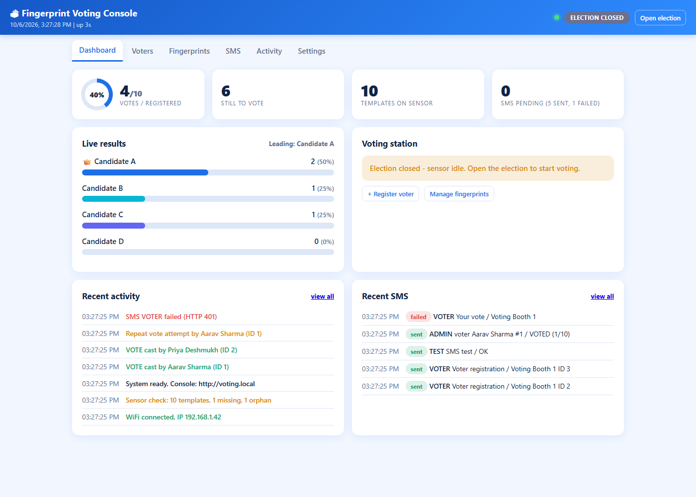
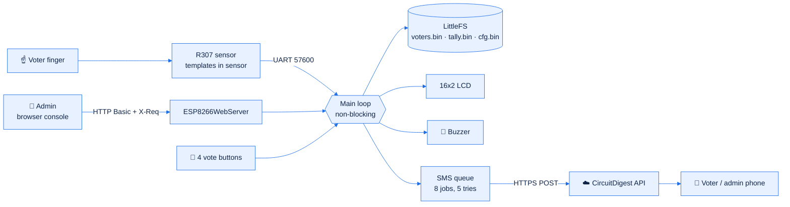
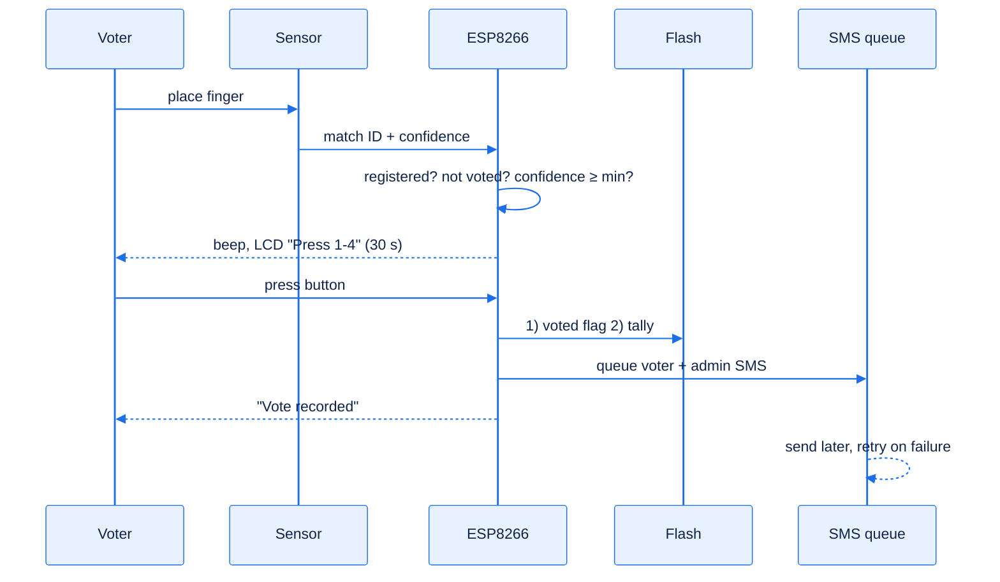
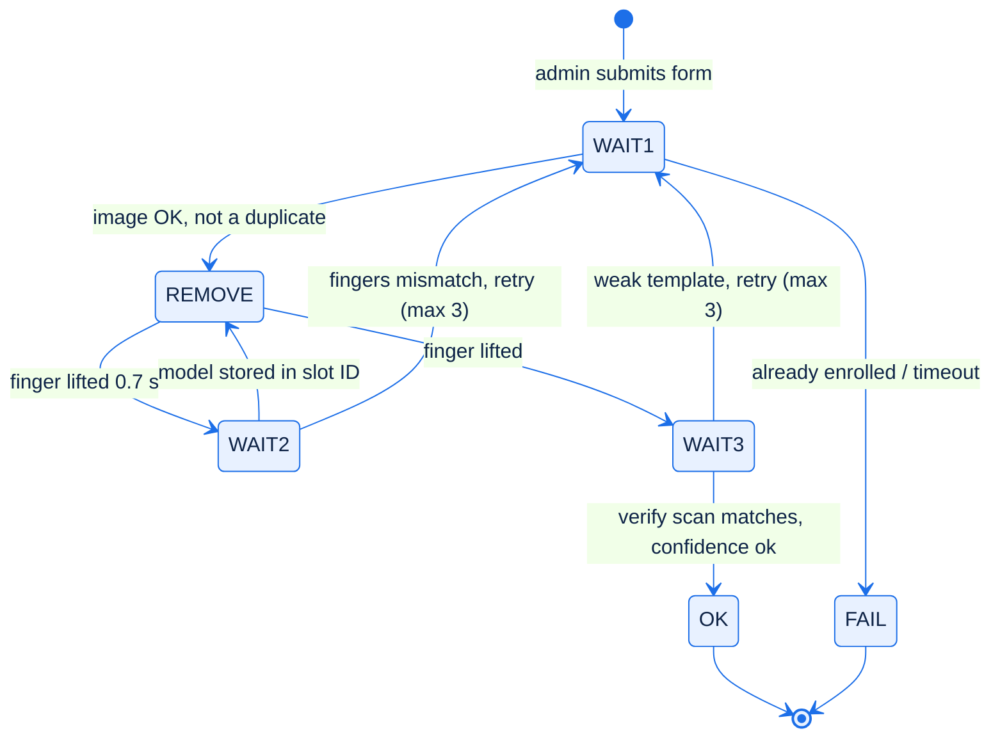
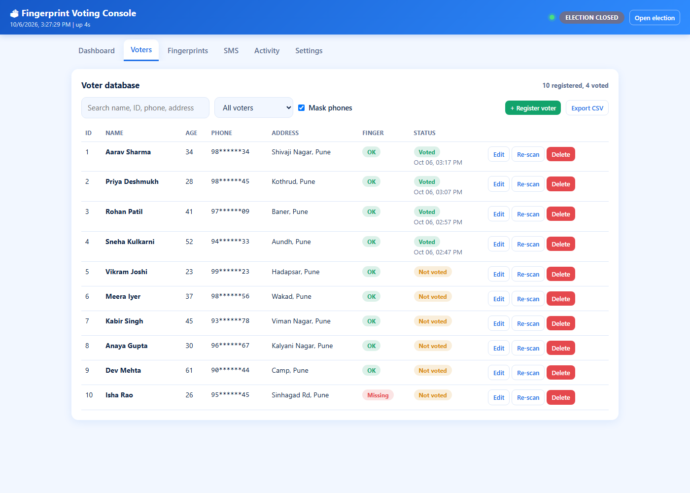
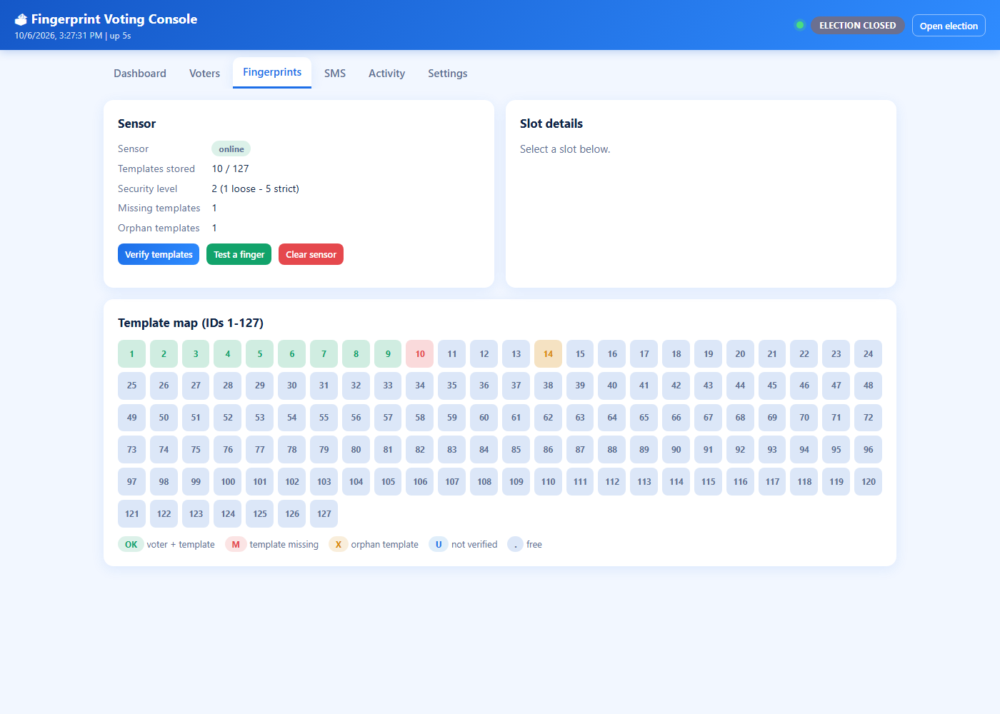
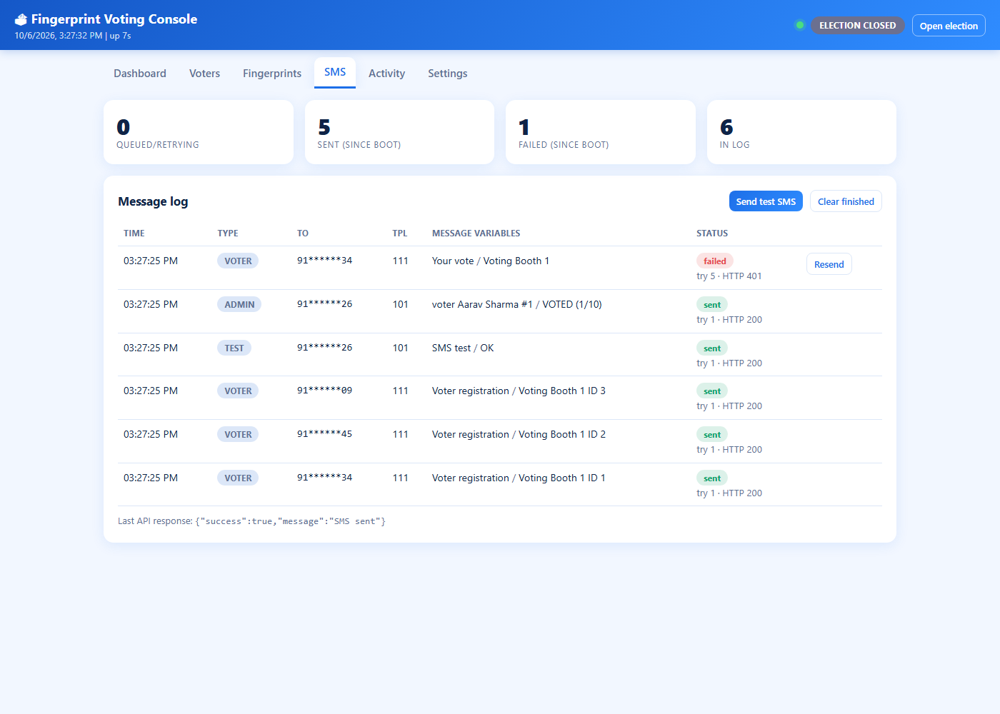
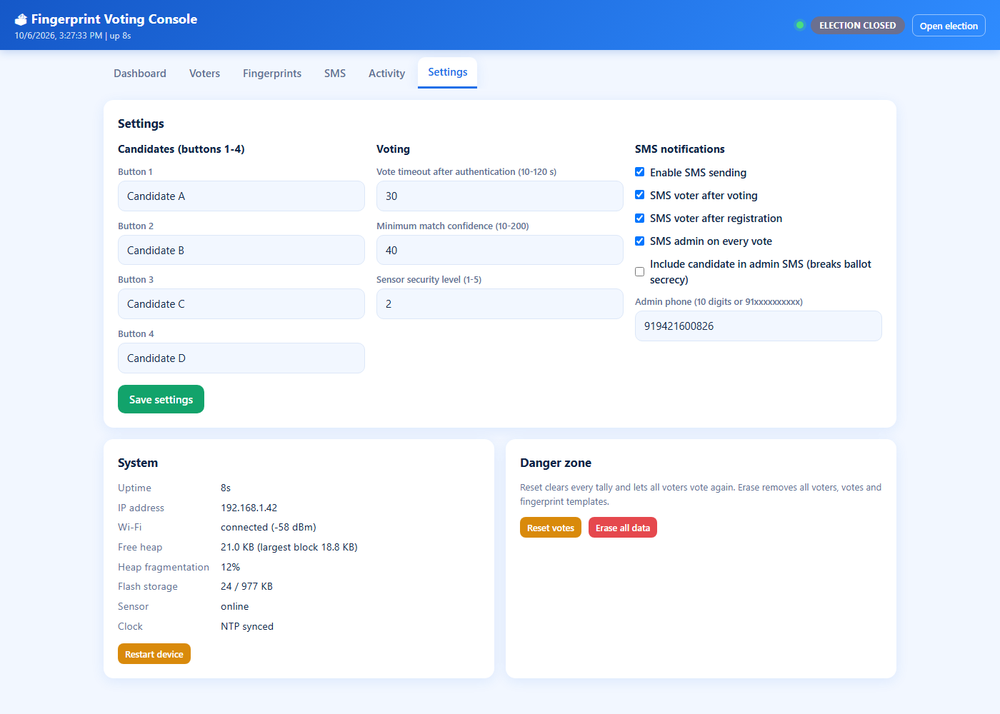

<div align="center">

# 🗳️ Fingerprint Voting System with SMS

**ESP8266 · R307 fingerprint sensor · web admin console · SMS receipts**


[Quick start](#-quick-start) · [How it works](#-how-it-works) · [Wiring](#-wiring) · [Memory](#-why-memory-looks-full) · [SMS setup](#-circuitdigest-sms-setup) · [SMS troubleshooting](#-why-the-sms-does-not-reach-a-voter) · [API](#-json-api) · [Roadmap](#-roadmap)



</div>

> **Tap any ▶ line below to expand it.** GitHub renders the diagrams and collapsible sections; nothing here needs JavaScript.

---

## 📌 What it is

A self-contained voting booth. A voter places a finger on the sensor, the board recognises them, and they press one of four buttons. The vote is counted anonymously, the voter is flagged as "voted", and an SMS receipt is sent in the background. Everything, including the admin web console, runs on one NodeMCU.

| | |
|---|---|
| 👤 **Voters** | Up to **40** (sensor slots 1 to 40), stored in LittleFS flash |
| 🗳️ **Candidates** | 4, each with its own button |
| 🔒 **Ballot secrecy** | Only per-candidate totals are stored; no log says who voted for whom |
| 📩 **SMS** | CircuitDigest cloud API, queued with retries, never blocks voting |
| 🖥️ **Console** | Blue and white single-page app at `http://voting.local` |

There is also an older **split design** (`legacy/`) where a laptop holds the database. It is not compatible with the standalone sketch.

---

## 🚀 Quick start

1. **Install** the Arduino IDE, the *ESP8266 core 3.x*, and the library **Adafruit Fingerprint Sensor Library**.
2. **Board settings:** `NodeMCU 1.0 (ESP-12E)`, Flash size `4MB (FS:1MB OTA:~1019KB)`.
3. **Secrets:** copy `secrets.example.h` to `secrets.h` and fill in WiFi, admin login, SMS key and admin phone. `secrets.h` is git-ignored.
4. **Open** `firmware/voting_with_sms/voting_with_sms.ino` and upload it (the folder must contain only this sketch, `types.h`, `webui.h`, `secrets.h`).
5. Open the serial monitor at 115200 baud, then browse to `http://voting.local` (or the IP on the LCD).
6. Register voters, press **Open election**.

<details>
<summary>▶ Command-line build (what was used to check this repo)</summary>

```bash
arduino-cli compile --fqbn esp8266:esp8266:nodemcuv2:eesz=4M1M firmware/voting_with_sms
```

Last measured result: flash **511,048 / 1,048,576 B (48%)**, static RAM **44,676 / 80,192 B (55%)**, IRAM **63,455 / 65,536 B (96%)**. Compiles cleanly; **not yet run on hardware after the latest edits.**

</details>

<details>
<summary>▶ Fallback hotspot</summary>

If WiFi has not connected after 25 s the board starts the hotspot `VotingStation` (password in the sketch). The console works there, but **SMS cannot be sent** because a hotspot has no internet.

</details>

---

## 🧭 How it works



### The voting flow



The **voted flag is written before the tally** on purpose: a power cut can then never allow a second vote.

<details>
<summary>▶ Enrollment state machine</summary>



</details>

---

## 🔌 Wiring

<details open>
<summary>▶ Pin map (no external resistors)</summary>

| Part | NodeMCU | GPIO | Notes |
|---|---|---|---|
| Sensor TX | D1 | 5 | SoftwareSerial RX |
| Sensor RX | D2 | 4 | SoftwareSerial TX |
| Sensor VCC / GND | **VIN (5 V)** / GND | | At 3V3 the LED lights but it will not talk |
| LCD SDA / SCL | D3 / D4 | 0 / 2 | Address 0x27 or 0x3F auto-detected |
| Button 1, 2, 3 | D5, D6, D7 | 14, 12, 13 | Other leg to GND, internal pull-up, pressed = LOW |
| Button 4 | D8 | 15 | Other leg to 3V3, pressed = HIGH (GPIO15 has the board's pull-down) |
| Buzzer (active) | D0 | 16 | Other leg to GND |

Diagram: [`docs/wiring.svg`](docs/wiring.svg)

</details>

---

## 🖥️ Admin console

<table>
<tr>
<td><br><sub>Voters: search, filter, edit, CSV export</sub></td>
<td><br><sub>Fingerprints: slot map, verify, test a finger</sub></td>
</tr>
<tr>
<td><br><sub>SMS: status, attempts and HTTP code per message</sub></td>
<td><br><sub>Settings: candidates, timeouts, SMS switches</sub></td>
</tr>
</table>

---

## 🧩 Repository structure

```
.
├── firmware/
│   └── voting_with_sms/        <- open this folder in the Arduino IDE
│       ├── voting_with_sms.ino    main firmware
│       ├── types.h                shared types
│       ├── webui.h                admin console (PROGMEM page)
│       ├── secrets.example.h      credentials template
│       └── secrets.h              YOUR credentials (git-ignored)
├── legacy/                     older split design (not compatible)
│   ├── voting_bridge/voting_bridge.ino
│   └── voting_station.py
├── docs/
│   ├── wiring.svg
│   ├── circuitdigest-setup.html   open in a browser
│   └── screenshots/
├── README.md · CLAUDE.md · .gitignore
```

## 🧩 Code layout

| File | Role |
|---|---|
| [`voting_with_sms.ino`](firmware/voting_with_sms/voting_with_sms.ino) | Firmware: storage, SMS queue, sensor, enrollment, station, JSON API, setup/loop |
| [`types.h`](firmware/voting_with_sms/types.h) | `SmsJob`, `SmsStatus`, `EnrStep` (needed before the auto-generated prototypes) |
| [`webui.h`](firmware/voting_with_sms/webui.h) | Whole console as one PROGMEM string (served from flash, not RAM) |
| [`secrets.example.h`](firmware/voting_with_sms/secrets.example.h) | Template for credentials. Copy to `secrets.h` |
| `secrets.h` | Your real credentials. **Git-ignored, never commit it** |
| [`docs/wiring.svg`](docs/wiring.svg), [`docs/screenshots/`](docs/screenshots) | Wiring diagram and console screenshots |
| [`legacy/voting_bridge/`](legacy/voting_bridge/voting_bridge.ino), [`legacy/voting_station.py`](legacy/voting_station.py) | Older split design (serial bridge + Tkinter app) |
| [`CLAUDE.md`](CLAUDE.md) | Notes for AI assistants working in this repo |

<details>
<summary>▶ Main loop (everything non-blocking; do not add <code>delay()</code>)</summary>

```
server.handleClient → MDNS.update → buzzerTick → wifiTick → sensorWatch
→ enrTick → stationTick → verifyTick → lcdTick → smsTick → housekeeping
```

The one exception is a single HTTPS SMS call (1 to 3 s), which waits while an enrollment or a vote is in progress.

</details>

<details>
<summary>▶ Storage and the magic number</summary>

Each file starts with a 4-byte magic derived from `sizeof(struct)`. If you change `Voter` or `AppConfig`, the old file is ignored and re-created, so **existing voters disappear**. Export the CSV first.

| File | Content |
|---|---|
| `/voters.bin` | `Voter voters[41]`, index = sensor slot |
| `/tally.bin` | `uint32_t votes[4]` |
| `/cfg.bin` | `AppConfig` (names, SMS flags, election state, thresholds) |

Fingerprint templates live **inside the sensor**. Always delete voters through the console so the template goes too.

</details>

---

## 🧠 Why memory looks full

The ESP8266 is a microcontroller with about **80 KB of data RAM**, shared by your variables, the WiFi stack, and the heap. Measured on this build:

| Region | Used | Of | |
|---|---|---|---|
| Flash (code) | 511,048 B | 1,048,576 B | 48% ✅ |
| Static RAM | 44,676 B | 80,192 B | 55% ⚠️ |
| IRAM | 63,455 B | 65,536 B | **96%** 🔴 (normal, see below) |

<details open>
<summary>▶ The five causes, biggest first</summary>

1. **IRAM at 96%.** This is the figure that looks alarming. The WiFi and runtime code live there, plus 32 KB reserved for the flash cache. It is fixed by the core and does not leave room to grow. **Do not add `IRAM_ATTR` or `ICACHE_RAM_ATTR` to your own functions.**
2. **Static RAM 44.7 KB.** About 34 KB is library buffers (WiFi, BearSSL, web server, SoftwareSerial), and 8.8 KB is string literals sitting in RAM (JSON key names, log messages). Your own tables are small: voters ≈ 3.4 KB, event log ≈ 1.6 KB, SMS queue ≈ 1 KB.
3. **Free heap is only about 35 KB at boot** and drops while WiFi runs. An HTTPS SMS needs roughly **16 KB**: 6 KB receive buffer, 0.5 KB send buffer, and the handshake.
4. **Fragmentation.** The web handlers build JSON with many `String +` operations. Each makes and frees small blocks, so the heap can show 20 KB free yet have no 9 KB contiguous block. TLS needs a contiguous block, so the SMS stalls.
5. **History.** An earlier version had 127 voter slots (about 10 KB). It was cut to 40 to leave room for TLS.

**What this release changed**

- The SMS gate now checks the **largest free block** (≥ 9 KB) as well as total free heap, and logs both numbers.
- The `/api/state` JSON buffer is reserved at the right size (fewer reallocations).
- Credentials moved out of the sketch, so they never reach GitHub.

**Next steps if you need more headroom**

- Wrap constant strings in `F()` or `PSTR()` (saves up to about 8 KB of RAM).
- Stream `/api/state` with `server.sendContent` instead of one big `String`.
- Watch **Settings → System → Free heap / Largest block / Fragmentation** while using the console. If the largest block stays below 9 KB, SMS will wait.

</details>

---

## 📲 CircuitDigest SMS setup

<details open>
<summary>▶ Six steps from account to first SMS</summary>

1. Create an account at [circuitdigest.cloud](https://www.circuitdigest.cloud).
2. Copy your **API key** (account menu, API Key section).
3. **Link the phone numbers** that will receive SMS (free plan: up to 5). Include the admin number and any voter you want to test with.
4. Copy `secrets.example.h` to `secrets.h` and set `SMS_API_KEY` and `DEFAULT_ADMIN_PHONE` (country code first, for example `91XXXXXXXXXX`).
5. Upload the sketch, open the console, go to **Settings → SMS**, switch SMS on and enter the admin phone.
6. Go to the **SMS** tab and press **Send test**. The row should show `sent` with HTTP `200`.

</details>

<details>
<summary>▶ Test the key from a terminal before uploading</summary>

```bash
curl -X POST "https://www.circuitdigest.cloud/api/v1/send_sms?ID=101" \
  -H "Authorization: YOUR_API_KEY" \
  -H "Content-Type: application/json" \
  -d '{"mobiles":"91XXXXXXXXXX","var1":"SMS test","var2":"OK"}'
```

</details>

| Limit (free plan) | Value |
|---|---|
| SMS per month | 100 |
| Linked numbers | 5 |
| Characters per variable | 30 |
| Countries | India only (prefix 91) |

| Template | Used for | Text |
|---|---|---|
| 111 | Voter registered or voted | The task {var1} has been successfully completed at {var2}. |
| 101 | Admin per vote, tests | Your {var1} is currently at {var2}. |
| 107 | Admin alert | Error {var1} has been detected in {var2}. |

Source: [CircuitDigest SMS API article](https://circuitdigest.com/article/free-sms-api-for-arduino-esp32-esp8266-nodemcu-raspberry-pi). Limits can change, so check your account page.

---

## 📩 Why the SMS does not reach a voter

The queue itself works: the SMS tab shows every message and its HTTP code. Check that code first.

| HTTP code in the SMS tab | Meaning | Fix |
|---|---|---|
| **401** | API key missing or wrong | Copy the key again from your CircuitDigest account into `secrets.h` |
| **403** | Monthly limit reached | Free plan is **100 SMS per month**. Each vote can use 2 SMS plus 1 on registration, so about 30 voters can use it up |
| **400** | Missing field, or number/variable rejected | Number must be 10 digits (the code adds `91`). Variables are limited to **30 characters** (fixed in this release, was 39) |
| `-1`, `-5`, `-11` + "TLS …" text | Connection or TLS failed | Low memory or no internet. Check Free heap and Largest block |
| stays **queued** | Waiting | WiFi down, in hotspot mode, or heap too low (see Activity tab) |

<details open>
<summary>▶ Most likely reason a <b>voter</b> number never receives anything</summary>

CircuitDigest's free SMS API is **India only** and lets one account **link up to 5 phone numbers**. The admin number is linked, so admin and test messages work, but a voter's number that is not linked to your account is refused. Voter SMS is therefore the one that fails.

What to do:

- Link the voter numbers in your CircuitDigest account (maximum 5), or
- use a paid or bulk provider with DLT-registered templates for real elections, or
- turn off *SMS to voter* and keep only the admin alert.

I could not confirm from the public documentation which exact HTTP code an unlinked number returns, so treat the SMS tab's code and "Last response" as the final word.

</details>

<details>
<summary>▶ Other things that block SMS</summary>

- **Template text must match** what the provider registered (111, 101, 107).
- **Country code is hard-coded** to `91`.
- TLS uses `setInsecure()` (no certificate check). Acceptable for a demo, not for production.
- `SMS_MAX_ATTEMPTS` is 5; HTTP 400/401/403/404 fail immediately without retrying.

</details>

---

## 🔌 JSON API

All routes need HTTP Basic auth. POST routes also need an `X-Req` header.

<details>
<summary>▶ GET routes</summary>

`/api/state` (poll target), `/api/settings`, `/api/voters`, `/api/fp`, `/api/log`, `/api/sms`, `/api/export.csv`

</details>

<details>
<summary>▶ POST routes</summary>

`/api/election`, `/api/enroll`, `/api/enroll/cancel`, `/api/voter/update`, `/api/voter/delete`, `/api/votes/reset`, `/api/factory`, `/api/fp/verify`, `/api/fp/identify`, `/api/fp/delete`, `/api/fp/clear`, `/api/settings`, `/api/sms/test`, `/api/sms/resend`, `/api/sms/clear`, `/api/reboot`

</details>

`/api/state.rev` carries change counters (`v` voters, `s` sms, `l` log, `f` fingerprints, `c` settings); the UI re-downloads a list only when its counter moves.

---

## 🔐 Security notes

- Credentials live in `secrets.h` (git-ignored). **If an API key was ever committed or shared, regenerate it.** The key from the earlier sketch has been in plain text and should be rotated.
- HTTP Basic over plain HTTP is not encrypted. Use a trusted network only.
- Change the default `admin` / `admin123` login.

## 🗺️ Roadmap

- [ ] Move constant strings to PROGMEM and stream `/api/state`
- [ ] Add a pre-flight SMS check (HTTP code shown on the dashboard)
- [ ] Optional fallback provider for voters outside the 5-number limit
- [ ] Certificate pinning for the SMS call
- [ ] Run the new build on hardware and record the free-heap numbers

## 📄 Licence

Add a licence file before publishing (MIT is a common choice for hobby projects).
