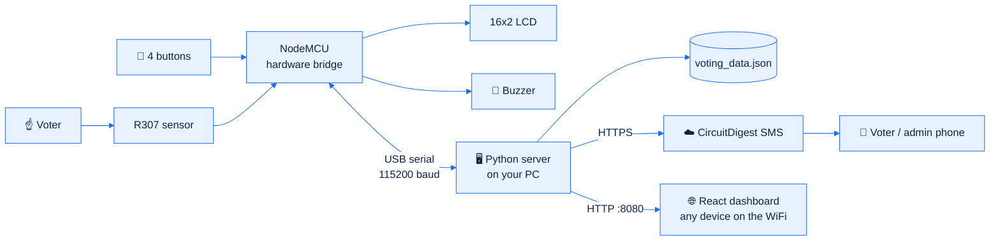
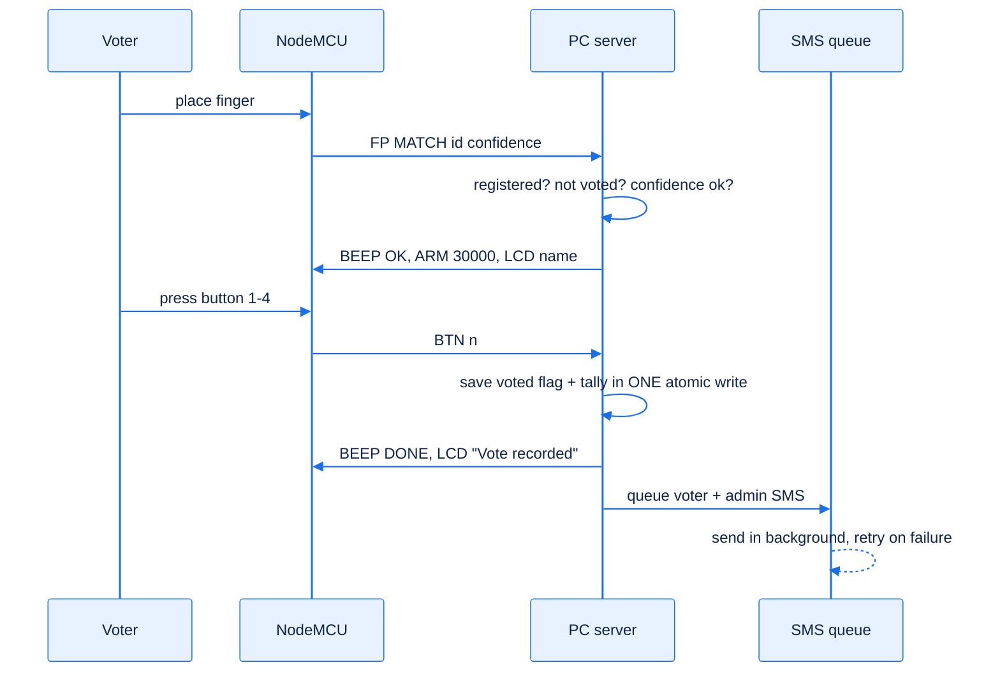

<div align="center">

# 🗳️ Fingerprint Voting System with SMS

**NodeMCU hardware bridge · Python server on your PC · React web dashboard · CircuitDigest SMS**


[Quick start](#-quick-start) · [What to upload](#-what-do-i-upload-to-the-arduino) · [How it works](#-how-it-works) · [Wiring](#-wiring) · [SMS](#-circuitdigest-sms) · [API](#-json-api) · [Tests](#-tests)


<sub>More: <a href="docs/screenshots/ui_results.png">Results</a> · <a href="docs/screenshots/ui_voters.png">Voters</a> · <a href="docs/screenshots/ui_fp.png">Fingerprints</a> · <a href="docs/screenshots/ui_sms.png">SMS</a> · <a href="docs/screenshots/ui_set.png">Settings</a></sub>

</div>

---

## 📌 What it is

A fingerprint voting booth. A voter places a finger on the sensor, the system recognises them, and they press one of four buttons. The vote is counted anonymously, the voter is marked "voted", and an SMS receipt is sent in the background.

**The NodeMCU's memory used to fill up** because it ran everything: database, web server, TLS for SMS. Now the work is split:

| Where | Does what |
|---|---|
| **NodeMCU** (`firmware/voting_bridge`) | Only the hardware: fingerprint sensor, 4 buttons, LCD, buzzer. WiFi is switched **off**. About 300 lines, no database, no web server, no TLS. |
| **Your PC** (`server/`) | Python server: voter database, vote counting, enrollment logic, **CircuitDigest SMS**, and the **web dashboard**. |
| **Any phone or laptop on your WiFi** | Opens the dashboard at `http://<PC address>:8080` and signs in. |



---

## 🚀 Quick start

### ⚡ One-click (Windows)

1. Plug the NodeMCU into the PC with a **data** USB cable.
2. Double-click **`setup.bat`**.

It installs Python packages (in a private `.venv`), `arduino-cli`, the ESP8266 core and the fingerprint library, **compiles and uploads the NodeMCU firmware**, asks for your dashboard login, CircuitDigest API key and admin phone, writes `server/config.json`, opens the Windows Firewall for the dashboard, starts the server and opens the dashboard. It is safe to re-run; finished steps are skipped.

**Every day after that:** plug in the NodeMCU, double-click **`start.bat`**, open `http://localhost:8080` (or `http://<PC address>:8080` from another device; the exact address is printed in the server window and shown on the LCD).

### 🔼 What do I upload to the Arduino?

Upload **exactly one sketch**: [`firmware/voting_bridge/voting_bridge.ino`](firmware/voting_bridge/voting_bridge.ino) (`setup.bat` does this for you).

- Board: **NodeMCU 1.0 (ESP-12E Module)**. Flash size: any (4MB is fine).
- Library: **Adafruit Fingerprint Sensor Library** (it pulls in Adafruit BusIO). Everything else ships with the ESP8266 core.
- It needs **no WiFi name, no password, no API key**. Those live on the PC in `server/config.json`.
- Close the Arduino Serial Monitor afterwards: it would hold the COM port and the server could not open it.

Do **not** upload anything from `legacy/`; it is the old all-on-the-ESP version that ran out of memory.

### Manual steps

1. Upload `firmware/voting_bridge/voting_bridge.ino` from the Arduino IDE.
2. `pip install -r server/requirements.txt` (only `pyserial`).
3. Copy `server/config.example.json` to `server/config.json` and fill it in.
4. `python server/voting_server.py`, then open `http://localhost:8080`.
5. Register voters (**Voters → Register voter**), press **Open election**.

<details>
<summary>▶ Try it without hardware</summary>

```bash
python server/voting_server.py --sim
```

A built-in simulator replaces the NodeMCU. Fake fingers and buttons: `POST /api/sim/finger` (`f=<finger number>`) and `POST /api/sim/button` (`n=1..4`). The automated tests use exactly this.

</details>

<details>
<summary>▶ Other devices cannot open the dashboard?</summary>

- Both devices must be on the same WiFi/network.
- Windows Firewall must allow port 8080 (`setup.bat` offers to add the rule). Manually: `netsh advfirewall firewall add rule name=VotingDashboard dir=in action=allow protocol=TCP localport=8080 profile=private` (as administrator).
- Guest WiFi networks often isolate devices from each other.
- To change the port, set `http_port` in `server/config.json`.

</details>

---

## 🧭 How it works



- **Registration.** The admin enters ID, name, age, phone, address and ticks the voter-consent box. The sensor guides two scans plus a verification scan. The voter record is saved only when the sensor confirms the verified template.
- **Voting.** The sensor is polled while the election is open. A recognised voter who has not voted gets `vote timeout` seconds (default 30) to press a button. A repeat attempt is refused and logged.
- **Safety.** The voted flag and the tally are saved in one atomic file write (write temp, flush, rename), so a power cut can never produce a half-counted vote or a second vote.
- **SMS.** A background thread sends through CircuitDigest, retries up to 5 times with growing waits, and survives a server restart (the queue is saved). Voting never waits for the network.
- **If the USB cable is pulled,** the server notices within 7 seconds, shows a red banner, cancels the pending voter, and reconnects by itself when the cable is back. The NodeMCU's LCD shows "PC not connected".

### 🔒 Ethics and privacy

- **Ballot secrecy.** Only per-candidate totals are stored. No voter record, log line, SMS or chart says how an individual voted. The "votes over time" chart uses totals only.
- **The admin SMS does not include the candidate** unless the admin switches it on, and the console warns that this breaks secrecy.
- **Consent.** Registration requires an explicit tick that the voter agrees to the fingerprint template and to SMS.
- **Phone numbers are masked** in the console by default.
- **Auditable.** Every registration, vote (without candidate), failed or repeated attempt, reset and erase is in the activity log and in `server/data/voting_log.txt`.
- **Accessible.** Keyboard navigation, visible focus, labelled controls, results never rely on colour alone, light and dark themes, respects reduced-motion.
- **Be honest with voters:** a fingerprint template is biometric data. Keep the PC and `server/data/` private and delete them when the election is over (Settings → Erase all data).

---

## 🔌 Wiring

Unchanged from the previous version. No external resistors.

| Part | NodeMCU | GPIO | Notes |
|---|---|---|---|
| Sensor TX | D1 | 5 | SoftwareSerial RX (a swapped TX/RX is auto-detected) |
| Sensor RX | D2 | 4 | SoftwareSerial TX |
| Sensor VCC / GND | **VIN (5 V)** / GND | | At 3V3 the LED lights but it will not talk |
| LCD SDA / SCL | D3 / D4 | 0 / 2 | Address 0x27 or 0x3F auto-detected, VCC to VIN |
| Button 1, 2, 3 | D5, D6, D7 | 14, 12, 13 | Other leg to GND, pressed = LOW |
| Button 4 | D8 | 15 | Other leg to 3V3, pressed = HIGH |
| Buzzer (active) | D0 | 16 | Other leg to GND |

Diagram: [`docs/wiring.svg`](docs/wiring.svg)

---

## 🖥️ The dashboard

React (no build step: React 18 and `htm` are vendored in `server/static/js/vendor`, so it works offline on your LAN).

| Tab | What you can do |
|---|---|
| **Dashboard** | Turnout ring, live results, station status, recent activity and SMS, the address to open from other devices |
| **Results** | Bars, donut and votes-over-time chart, ballot-secrecy note, **export results CSV**, **print** |
| **Voters** | Search, filter, register (with consent), edit, re-scan finger, delete, CSV export, phone masking |
| **Fingerprints** | Map of all 127 slots, verify templates, test a finger, delete orphans, clear the sensor |
| **SMS** | Live status of every message, resend, test SMS, API key check |
| **Activity** | Filterable audit log, download |
| **Settings** | Candidates, timeouts, sensor security, SMS switches, hardware status, restart hardware, reset votes, erase |

---

## 🧩 Repository structure

```
.
├── firmware/voting_bridge/     <- UPLOAD THIS to the NodeMCU
│   └── voting_bridge.ino
├── server/                     <- runs on the PC
│   ├── voting_server.py           entry point
│   ├── vs/                        config, store, bridge (serial + simulator), sms, core, web
│   ├── static/                    React dashboard (index.html, css/, js/)
│   ├── tests/                     end-to-end tests (simulator + fake serial)
│   ├── config.example.json        copy to config.json (git-ignored)
│   └── data/                      voters, tally, SMS log (git-ignored, created at run time)
├── docs/                       wiring diagram, CircuitDigest guide, screenshots
├── legacy/                     older designs, kept for reference. Do not upload.
│   ├── standalone_esp8266/        everything on the ESP (ran out of memory)
│   └── voting_bridge/, voting_station.py   first split design (Tkinter GUI)
├── scripts/make-config.ps1     helper used by setup.bat
├── setup.bat                   one-click installer
├── start.bat                   starts the server
└── README.md · CLAUDE.md · .gitignore
```

<details>
<summary>▶ USB serial protocol (NodeMCU ↔ PC)</summary>

115200 baud, one text line per message. Full table in the header comment of `voting_bridge.ino`.

| PC → NodeMCU | NodeMCU → PC |
|---|---|
| `PING`, `INFO`, `SEC n` | `PONG`, `INFO sensor=1 capacity=N count=M sec=S fw=4` |
| `SCAN 1/0` | `FP MATCH id conf`, `FP NOMATCH`, `FP ERR why` |
| `ENROLL id rescan minconf`, `CANCEL` | `ENR PLACE1/REMOVE p/PLACE2/VERIFY/NOTE/RETRY n why`, `ENR OK id conf`, `ENR FAIL why` |
| `DEL id`, `EMPTY`, `MAP max` | `DEL OK/FAIL id`, `EMPTY OK/FAIL`, `SLOT id 1/0/2`, `MAP DONE n` |
| `ARM ms`, `DISARM` | `BTN n`, `ARM TIMEOUT` |
| `BEEP OK/ERR/LONG/DONE`, `LCD line1\|line2`, `RESET` | `READY`, `SENSOR OK cap`, `SENSOR LOST why`, `HB 0/1` every 2 s |

</details>

---

## 📲 CircuitDigest SMS

1. Create an account at [circuitdigest.cloud](https://www.circuitdigest.cloud) and copy your **API key**.
2. **Link the phone numbers** that will receive SMS (free plan: up to 5).
3. Enter the key and admin phone in `setup.bat` (or `server/config.json`).
4. In the dashboard open **SMS → Send test SMS**. The row should say `sent`, HTTP `200`.

| Limit (free plan) | Value |
|---|---|
| SMS per month | 100 |
| Linked numbers | 5 |
| Characters per variable | 30 |
| Countries | India only (prefix 91) |

| Template | Used for | Text |
|---|---|---|
| 111 | Voter registered or voted | The task {var1} has been successfully completed at {var2}. |
| 101 | Admin per vote, tests | Your {var1} is currently at {var2}. |
| 107 | Admin alert | Error {var1} has been detected in {var2}. |

| HTTP code in the SMS tab | Meaning |
|---|---|
| **200** | Sent |
| **401** | API key missing or wrong |
| **403** | Monthly limit reached |
| **400** | Number not linked to your account (the usual reason a *voter* gets nothing), or a bad field |
| `0` | No internet from the PC |

The PC verifies the server's TLS certificate (the old ESP build could not).

---

## 🔌 JSON API

All routes need HTTP Basic login. POST routes also need an `X-Req` header.

- **GET:** `/api/state` (poll target), `/api/settings`, `/api/voters`, `/api/fp`, `/api/log`, `/api/sms`, `/api/results`, `/api/export.csv`, `/api/results.csv`
- **POST:** `/api/election`, `/api/enroll`, `/api/enroll/cancel`, `/api/voter/update`, `/api/voter/delete`, `/api/votes/reset`, `/api/factory`, `/api/fp/verify`, `/api/fp/identify`, `/api/fp/delete`, `/api/fp/clear`, `/api/settings`, `/api/sms/test`, `/api/sms/resend`, `/api/sms/clear`, `/api/reboot`

`/api/state.rev` carries change counters; the dashboard re-downloads a list only when its counter moves.

## 🧪 Tests

```bash
cd server
python -m unittest discover -s tests -v
```

`test_sim.py` runs the whole system against the firmware simulator (enroll, duplicate refusal, vote, repeat refusal, ballot secrecy, SMS, closing mid-vote, delete, persistence). `test_serial.py` drives the real serial code through a fake port, including unplug and reconnect. **The NodeMCU firmware itself has been compiled but not yet run on hardware.**

## 🔐 Security notes

- Credentials live in `server/config.json` (git-ignored). **If an API key was ever committed or shared, regenerate it.** An earlier version of this repo contained one in `legacy/voting_station.py`; rotate it.
- HTTP Basic over plain HTTP is not encrypted. Use a trusted network only, and choose a strong dashboard password.
- The dashboard binds to all network interfaces so other devices can reach it. Set `"bind": "127.0.0.1"` to restrict it to this PC.

## 🗺️ Roadmap

- [ ] Run the new firmware on hardware and record real-world timings
- [ ] Optional HTTPS for the dashboard
- [ ] Optional fallback SMS provider for voters outside the 5-number limit

## 📄 Licence

Add a licence file before publishing (MIT is a common choice for hobby projects).
